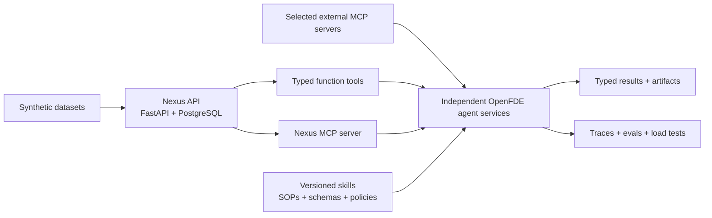

# OpenFDE Studio

OpenFDE Studio is an open-source engineering lab for building, testing, and comparing production agent architectures with the OpenAI Agents SDK.

The repository is organized as a set of independent agent services that share one deliberately small business-data backend. Each service isolates a different systems problem—tool calling, skills, MCP, retrieval, memory, planning, routing, handoffs, multi-agent orchestration, or realtime voice—and includes the datasets, traces, evaluations, and failure cases needed to understand whether it works.

> **Status:** Pre-alpha. The architecture and specifications are complete; the first runnable vertical slice is the next milestone.

## What We Are Looking to Solve

Agent SDK quickstarts explain how to create an agent or call a tool. They usually do not answer the application-level questions that determine whether an agent is safe, observable, testable, and useful:

- How should a backend capability be exposed: ordinary application code, a function tool, or an MCP tool?
- How do you give the model the smallest useful tool surface instead of every backend endpoint?
- How do you package an SOP as a reusable, versioned skill instead of embedding it in one large prompt?
- When should an LLM choose the next action, and when should deterministic code own the workflow?
- How should context, session memory, durable business state, and retrieved knowledge be separated?
- When should a manager invoke a specialist as a tool, transfer control with a handoff, or route in code?
- How do you require approval before a consequential write and resume the same run afterward?
- How do you verify route selection, tool arguments, evidence, policy compliance, latency, and cost—not only the final answer?
- How does the same design behave when a tool times out, MCP disconnects, evidence conflicts, or untrusted text contains prompt injection?

OpenFDE solves this documentation-to-production gap with runnable reference implementations built against the same domain and evaluated with the same engineering discipline.

This is not a collection of chat wrappers. The unit of work is a complete agent system:

```text
service contract
  + agent instructions
  + skill package
  + least-privilege tools
  + context and memory policy
  + orchestration strategy
  + guardrails and approvals
  + traces
  + versioned evaluation dataset
  + failure analysis
```

## Project Goals

OpenFDE is intended to:

1. Provide full-stack engineers with small, readable examples of real agent backends.
2. Compare alternative implementations of the same capability, such as function tools versus MCP and manager orchestration versus handoffs.
3. Make agent behavior testable through typed contracts, deterministic assertions, scenario datasets, and trace inspection.
4. Show how an agent architecture evolves only when measured failures justify additional retrieval, memory, workers, or infrastructure.
5. Produce reusable patterns that can be moved into support, sales, operations, research, scheduling, and internal-tool products.

## Non-Goals

The initial repository will not be:

- A general-purpose agent framework that replaces the OpenAI Agents SDK
- A full CRM, data warehouse, or customer-intelligence product
- A hosted no-code agent builder
- A giant MCP server that exposes every backend operation
- A frontend-first demo with agent logic hidden behind UI components
- A distributed platform with Redis, Temporal, queues, or Kubernetes before workload measurements require them

## Architecture



### System boundaries

| Layer | Responsibility | Initial implementation |
| --- | --- | --- |
| Nexus | Stable business data and narrow CRUD operations | One FastAPI service, PostgreSQL, SQLAlchemy, Alembic |
| Agent services | Agent configuration, skills, tools, execution, policy, and service-specific evaluations | One independently runnable FastAPI service per agent |
| Function tools | Typed, in-process adapters over Nexus capabilities | Built first for the shortest debug path |
| Nexus MCP | Portable read capabilities backed by the same Nexus service layer | Added after Agent 1 works with function tools |
| Skills | Versioned operating procedures and task-specific constraints | Loaded by the agent service; not stored as model memory |
| Sessions and context | Per-run dependencies and conversational working state | Explicitly selected per agent |
| Evaluation harness | Dataset execution, assertions, scoring, and baseline comparison | Shared test utilities plus agent-owned datasets |
| Observability | Model, tool, handoff, guardrail, timing, usage, and custom workflow events | Agents SDK tracing plus structured application logs |

Each agent service begins with the same minimal HTTP contract:

| Method | Route | Purpose |
| --- | --- | --- |
| `GET` | `/health` | Service and dependency health |
| `POST` | `/run` | Validate a typed request, execute the agent, and return a typed result |

Streaming, asynchronous jobs, approval-resume routes, and realtime transports are added only to the services that need them.

## Core Abstractions

### Skill

A skill is a versioned procedure for completing a class of work. An OpenFDE skill can contain:

- Instructions and decision rules
- Required source documents
- Input and output schemas
- Allowed and required tools
- Evidence and citation rules
- Approval and escalation policies
- Example cases and evaluation scenarios

A skill does not provide access to data by itself.

### Function tool

A function tool is a typed Python capability exposed directly to an agent. OpenFDE uses function tools when the capability is local to one service, requires application context, or benefits from the smallest possible implementation and debugging surface.

### MCP tool

An MCP tool is a capability published through a standard server boundary so that multiple compatible clients can discover and invoke it. OpenFDE uses MCP when portability, reuse, or independent deployment is part of the lesson. MCP wraps the same domain service layer; it does not duplicate Nexus business logic.

### Agent as tool

A manager agent invokes a specialist and retains ownership of the user interaction. This is useful when the manager must combine several typed specialist results.

### Handoff

The active agent transfers control to a specialist. This is useful when the specialist should own the next part of the conversation and its tool surface.

### Deterministic orchestration

Application code owns known ordering, retries, dependency execution, idempotency, and other rules that should not be decided probabilistically. Agents are used where interpretation or adaptive decisions are actually required.

## Nexus: Minimal Business Sandbox

Nexus is the shared synthetic customer-intelligence backend. It exists to make agent tasks realistic without making the data platform the project.

Nexus V1 contains six tables:

```text
accounts
calls
transcript_turns
documents
tasks
agent_results
```

It exposes thirteen REST routes:

```text
GET   /health
GET   /v1/accounts
GET   /v1/accounts/{account_id}
GET   /v1/calls
GET   /v1/calls/{call_id}
GET   /v1/calls/{call_id}/transcript
GET   /v1/documents
GET   /v1/documents/{document_id}
GET   /v1/tasks
POST  /v1/tasks
PATCH /v1/tasks/{task_id}
POST  /v1/agent-results
GET   /v1/agent-results/{result_id}
```

The model initially receives only eight narrow function tools:

```text
search_accounts
get_account
search_calls
get_call
get_call_transcript
list_documents
get_document
create_task
```

The first MCP server exposes the seven read tools. `create_task` remains a local approval-gated function tool until pause/resume behavior is reliable. `save_agent_result` and `update_task` remain application operations rather than general-purpose model tools.

> Nexus should be boring. The agents should be impressive.

## Agent Roadmap

The projects are built in order because each one reuses and stresses primitives introduced by the previous projects.

| # | Agent service | Primary pattern | Technical deliverable | SDK and systems concepts |
| --- | --- | --- | --- | --- |
| 1 | Structured Tool Agent | Tool-calling loop | Resolve accounts and calls, retrieve bounded data, and create an approval-gated task | `Agent`, `Runner`, function tools, MCP tools, Pydantic outputs, guardrails, sessions, approval, tracing |
| 2 | SOP Analysis and Artifact Agent | Grounded analysis pipeline | Score a call against versioned SOPs, attach turn-level evidence, and render JSON and HTML reports | Direct context, File Search comparison, structured output, evidence validation, artifact rendering |
| 3 | ReAct Investigation Agent | Bounded adaptive loop | Form hypotheses, select evidence, recover from failed tools, and stop with a grounded diagnosis | Multi-turn loops, dynamic tools, MCP failure handling, run context, maximum turns |
| 4 | Planner and Executor Agent | Plan-then-execute | Generate a typed dependency plan and execute approved steps deterministically with checkpoints | Structured planning, code orchestration, approvals, resumability, custom trace spans |
| 5 | ReWOO Research Agent | Plan, retrieve, synthesize | Plan evidence needs once, run independent retrieval concurrently, normalize results, and synthesize with provenance | Agents as tools, concurrency, result normalization, context control, cost comparison |
| 6 | Router and Handoff Agent | Classification and delegation | Select a skill or specialist and compare code routing, manager-as-tool, and handoff behavior | Structured classification, conditional tools, handoffs, input filters, session ownership |
| 7 | Multi-Agent Command Agent | Manager with specialists | Run specialist agents concurrently, merge typed recommendations, resolve conflicts, and enforce a budget | Agents as tools, nested traces, shared context, concurrency, guardrails, approvals |
| 8 | Realtime Voice Operations Agent | Realtime conversational workflow | Identify an account, answer questions, search availability, confirm a consequential action, and hand off safely | Realtime/voice agents, streaming audio, interruptions, tool calls, confirmation, voice handoffs |

The workflow taxonomy is informed by NVIDIA NeMo Agent Toolkit concepts such as tool-calling, ReAct, reasoning, ReWOO, routing, sequential workflows, and agents composed as functions. The implementation uses OpenAI Agents SDK primitives directly; OpenFDE does not depend on or reimplement NeMo Agent Toolkit.

## Build Order

### Phase 0 — Specifications

- [x] Define the eight-agent curriculum
- [x] Define Nexus data, API, function-tool, and MCP boundaries
- [x] Define the shared learning and evaluation contract
- [ ] Scaffold the monorepo, local environment, CI, and contribution templates

### Phase 1 — Tiny Nexus

- [ ] Implement one FastAPI application and PostgreSQL schema
- [ ] Add migrations for the six core tables
- [ ] Add the thirteen REST routes
- [ ] Create an idempotent seed CLI with 5 accounts, 20 calls, 4 documents, and 10 tasks
- [ ] Add repository, service, API, tenant-isolation, and idempotency tests
- [ ] Ship Docker Compose for local development

**Exit criterion:** calls can be searched, bounded transcript turns retrieved, documents loaded, and one task created idempotently.

### Phase 2 — Agent 1 with Function Tools

- [ ] Implement the `POST /run` contract
- [ ] Add account, call, transcript, document, and task function tools
- [ ] Add the first versioned skill and dynamic tool policy
- [ ] Require approval before `create_task`
- [ ] Emit typed output, traces, usage, latency, and tool-call records
- [ ] Build at least 25 routing, argument, policy, and failure scenarios

**Exit criterion:** at least 95% of deterministic tool and policy scenarios pass, tenant boundaries are never crossed, and no task can be written without approval.

### Phase 3 — Nexus MCP

- [ ] Publish the seven read capabilities through a local MCP server
- [ ] Reuse the Nexus service layer instead of duplicating domain logic
- [ ] Run the same Agent 1 dataset against function-tool and MCP variants
- [ ] Compare correctness, latency, trace shape, failure behavior, and implementation cost

**Exit criterion:** both adapters satisfy the same typed capability contract and the comparison is reproducible.

### Phase 4 — Agent 2 Call Analysis

- [ ] Create one call-analysis skill and four versioned SOP/rubric documents
- [ ] Build a reviewed dataset of at least 20 synthetic transcripts
- [ ] Produce Pydantic-validated scores, findings, and transcript-turn evidence
- [ ] Validate totals and evidence references deterministically
- [ ] Render the validated result to HTML and persist the structured result
- [ ] Test missing evidence, conflicting evidence, rubric changes, and prompt injection inside transcripts

**Exit criterion:** every score references a rubric version and evidence, deterministic totals agree, artifacts render from validated data, and the agent abstains when the source cannot support a conclusion.

This phase is the first public end-to-end release.

### Phase 5 — Retrieval Comparison

- [ ] Run Agent 2 with small documents loaded directly into context
- [ ] Run the same dataset with OpenAI File Search
- [ ] Optionally add a PostgreSQL/pgvector implementation only if the comparison needs it
- [ ] Publish retrieval quality, grounding, latency, token, and cost results

### Phases 6–11 — Advanced Agent Patterns

- [ ] Phase 6: ReAct investigation and tool-failure recovery
- [ ] Phase 7: Typed planning, deterministic execution, and resume checkpoints
- [ ] Phase 8: ReWOO-style parallel evidence collection and synthesis
- [ ] Phase 9: Router, skill selection, manager-as-tool, and handoff comparison
- [ ] Phase 10: Multi-agent coordination, conflict resolution, and budgets
- [ ] Phase 11: Realtime voice, interruption, confirmation, and handoff

Workers, Redis, durable workflow infrastructure, a control plane, and a frontend are optional later tracks. They are introduced only when a specific agent has a measured need for long-running jobs, concurrency control, resumability, or human interaction.

## Definition of a Complete Agent Project

An agent directory is not complete until it includes:

- A precise task and service contract
- A naive baseline implementation
- A hardened implementation
- Typed request, tool, and result schemas
- A documented skill and least-privilege tool policy
- Explicit context, memory, approval, and orchestration decisions
- Unit tests for deterministic code
- Integration tests for Nexus and MCP adapters
- A versioned scenario dataset
- Deterministic graders for routes, tools, arguments, schemas, policies, and workflow order
- Model-assisted graders only for genuinely subjective criteria
- Recorded traces for representative success and failure cases
- Latency, token, cost, and tool-call measurements
- Known limitations and an extension exercise

## Evaluation Contract

OpenFDE evaluates the decisions made during a run, not only the final prose.

| Evaluation layer | Example assertions |
| --- | --- |
| Input | Schema valid; tenant and identity context present |
| Routing | Correct skill, specialist, or deterministic path selected |
| Tools | Correct tool selected; arguments valid; no unnecessary capability exposed or called |
| Retrieval | Required evidence found; irrelevant context bounded; citations resolve |
| Workflow | Dependencies respected; retries bounded; stop condition reached |
| Policy | Approval required; forbidden writes blocked; untrusted content treated as data |
| Output | Structured schema valid; calculations deterministic; abstention used when needed |
| Operations | Latency, token use, cost, error rate, saturation, and recovery recorded |

Every observed failure should become a reproducible dataset case before it is considered fixed.

## Repository Topology

The planned monorepo structure keeps shared infrastructure small and agent implementations independent:

```text
openfde-studio/
├── apps/
│   └── nexus-api/
├── agents/
│   ├── 01-structured-tool/
│   ├── 02-sop-analysis/
│   ├── 03-react-investigator/
│   ├── 04-planner-executor/
│   ├── 05-rewoo-research/
│   ├── 06-router-handoff/
│   ├── 07-multi-agent-command/
│   └── 08-realtime-voice/
├── mcp-servers/
│   └── nexus/
├── packages/
│   ├── contracts/
│   └── evals/
├── skills/
├── datasets/
├── infrastructure/
│   └── docker/
└── docs/
```

Do not extract shared packages until at least two consumers prove the abstraction is real. Agent-specific prompts, schemas, tools, and datasets remain with their owning service.

## Technology Choices

| Area | Choice |
| --- | --- |
| Agent runtime | OpenAI Agents SDK for Python |
| API services | Python, FastAPI, Pydantic |
| Persistence | PostgreSQL, SQLAlchemy, Alembic |
| Capability protocol | Function tools first; custom MCP server second |
| Retrieval | Direct context, then File Search; optional pgvector comparison |
| Artifacts | Validated JSON rendered to HTML first; PDF and DOCX extensions later |
| Tests | Pytest, integration tests, versioned agent datasets, trace assertions |
| Local runtime | Docker Compose |
| Voice | OpenAI realtime/voice capabilities plus a minimal client |

## Engineering Rules

1. Keep Nexus smaller than the agent problem.
2. Expose domain capabilities, not database access or generic query endpoints.
3. Give each run the minimum tools required by the selected skill.
4. Keep writes local and approval-gated until the safety path is proven.
5. Use deterministic code for deterministic rules.
6. Start with direct context before adding a retrieval stack.
7. Separate run context, conversational session state, durable business data, and long-term memory.
8. Add queues, caches, workers, and orchestration infrastructure only after measurements justify them.
9. Maintain the same evaluation dataset when comparing architecture variants.
10. Publish failures and trade-offs, not unsupported production claims.

## Getting Started

The Next.js studio and a no-cost Promptfoo starter live at the repository root. Install and run them without committing `node_modules`, `.next`, or Promptfoo local output.

### Studio

```bash
pnpm --dir studio install
pnpm --dir studio dev
```

Then visit <http://localhost:3000>. Agents are defined in `studio/lib/agents.ts`.

### Promptfoo starter evaluation

Promptfoo requires Node.js 22.22 or newer. From the repository root:

```bash
pnpm install
pnpm eval
pnpm eval:view
```

The starter uses Promptfoo's local `echo` provider. It makes no network model requests and needs no API key. The dashboard is at <http://localhost:15500>. Configuration is in `evals/promptfooconfig.yaml`.

## Current Repository State

The repository contains the technical plan, the Nexus specification, a Next.js studio shell, and a Promptfoo starter evaluation. The next backend milestone is the monorepo, Nexus API, database migrations, seed data, tests, and Docker Compose before Agent 1 is implemented.

## Documentation

- [OpenFDE Studio Master Project Planner](./OPENFDE_STUDIO_MASTER_PROJECT_PLANNER.md)
- [Nexus Customer Intelligence Backend Specification](./NEXUS_CUSTOMER_INTELLIGENCE_BACKEND_SPEC.md)

## Contributing

The highest-value early contributions are narrow and testable:

- Synthetic calls, SOPs, rubrics, and adversarial edge cases
- Tool-selection, argument, routing, approval, and evidence datasets
- MCP adapter tests and failure simulations
- Versioned skill packages
- Deterministic graders and trace assertions
- Broken-agent reproductions with root-cause notes

Contribution guidelines and issue templates will be added with the repository scaffold.

## References

- [OpenAI Agents SDK](https://openai.github.io/openai-agents-python/)
- [OpenAI Agents SDK: Tools](https://openai.github.io/openai-agents-python/tools/)
- [OpenAI Agents SDK: MCP](https://openai.github.io/openai-agents-python/mcp/)
- [OpenAI Agents SDK: Agent orchestration](https://openai.github.io/openai-agents-python/multi_agent/)
- [OpenAI Agents SDK: Handoffs](https://openai.github.io/openai-agents-python/handoffs/)
- [OpenAI Agents SDK: Tracing](https://openai.github.io/openai-agents-python/tracing/)
- [OpenAI Agents SDK: Realtime agents](https://openai.github.io/openai-agents-python/realtime/)
- [NVIDIA NeMo Agent Toolkit](https://docs.nvidia.com/nemo/agent-toolkit/latest/)
